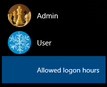
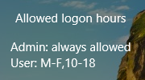

[](https://github.com/Anton-V-K/LogonHoursControl/actions)

# Logon Hours Control (for Windows)

The project provides utilities which allow you to establish/maintain *allowed logon hours* for Local Accounts in Windows 10+.

- `LogonHoursManager` is a GUI application to change the allowed logon hours for local users
- `LogonHoursMonitor` is a background tray application that shows allowed logon hours for all local users at the sign-in screen (via `LogonHoursMonitorCP.dll` credential provider)
- `LogonHoursService` it a service which monitors the allowed logon hours and locks the session once the time is over

The allowed logon hours are the ones you can set with a command like `net user USERNAME /time:M-F,10-18`.

## Compilation

You need VS2022 with v143 toolkit to build the solution.

The project can also be built with other versions of VisualStuido after tuning the properties:

1. Copy `_props\user\_Platform.props.IN` to `_props\user\_Platform.props`

2. Adjust `PlatformToolset` to specify available/desired toolset:
   
   ```
   <PropertyGroup Label="Configuration">  
     <PlatformToolset>v141</PlatformToolset> <!-- VS2017 -->  
   </PropertyGroup>
   ```

## Installation

Copy all binaries from the archive into a directory with read-only access to Everyone, so only Administrators can remove or update them (if needed).

### Manager

The application doesn't require any special installation.

### Monitor

- Use the binaries which match the architecture of your Windows; keep both `LogonHoursMonitor.exe` and `LogonHoursMonitorCP.dll` in the same directory.
- Run `LogonHoursMonitor.exe` to start the tray application (it also registers itself in the current user's Run key).
- As Administrator, register the sign-in credential provider: `LogonHoursMonitor.exe --install-cp`
- Sign out or lock the workstation to see the **Allowed logon hours** tile on the sign-in screen.

  
  
- To remove the sign-in tile: `LogonHoursMonitor.exe --uninstall-cp` (as Administrator).
- Prefer **Release** builds on a real machine; Debug builds must not use Address Sanitizer in the credential provider DLL.

**Recovery if the sign-in screen loops**

1. Boot **Safe Mode**.
2. Run `LogonHoursMonitor.exe --uninstall-cp` as Administrator, or delete  
   `HKLM\SOFTWARE\Microsoft\Windows\CurrentVersion\Authentication\Credential Providers\{8F2E4A9D-1B3C-4E5F-9A6B-7C8D9E0F1A2B}`  
   and `HKCR\CLSID\{8F2E4A9D-1B3C-4E5F-9A6B-7C8D9E0F1A2B}`.

### Service

- Run `LogonHoursService` from command line (with any permissions) for testing purposes, close its console window after ~5 seconds and examine the log in `%TEMP%\LogonHoursService.log`. The log should start with something like this:  
   `2021.11.28 02:31:03,322 [INFO] [2672] wmain: ========================================`  
   `2021.11.28 02:31:03,323 [INFO] [2672] wmain: Log initialized successfully`  
   `2021.11.28 02:31:03,323 [INFO] [2672] wmain: Version: 1.0.0 Alpha`  
   `2021.11.28 02:31:03,323 [INFO] [2672] wmain: Build  : Nov 27 2021 20:16:40`  
   `2021.11.28 02:31:03,323 [INFO] [2672] wmain: _MSC_FULL_VER: 19.29.30133`  
- As Administrator install the service by executing `LogonHoursService --install`.
- Start the service manually.
- Try setting time restrictions for a local user profile with a command like `net user USERNAME /time:M,12-13`.
- Check whether the session of `USERNAME` is locked when the specified time is over (take a look into the service log in `%windir%\Temp\LogonHoursService.log`)
- If everything works as expected, enable auto-start for the service.

## Troubleshooting

### Enable verbose logging

You can enable verbose logging by placing a file with name `LogonHoursService.exe.log4cpp` (into the directory with the executable) with the content like:  
`log4cpp.rootCategory=DEBUG`

The application writes its log into `%TEMP%\LogonHoursService.log` (`%TEMP%` is `%windir%\Temp` for `Local System` account).

### Enable Local Dumps creation

Dump files (`.dmp`) are very useful when you need to investigate an occasional crash.

Add registry key `HKLM\SOFTWARE\Microsoft\Windows\Windows Error Reporting\LocalDumps` (refer to the article [Collecting User-Mode Dumps](https://docs.microsoft.com/en-us/windows/win32/wer/collecting-user-mode-dumps) for more details).

After local dumps are enabled, you will be able to find the dump under `%LOCALAPPDATA%\CrashDumps` next time the crash happens.

If you're running the service under `Local System` account, its dumps are generated under `%windir%\System32\config\systemprofile\AppData\Local\CrashDumps` or `%windir%\SysWOW64\config\systemprofile\AppData\Local\CrashDumps` (for 32-bit services on 64-bit system)

### Missing `clang_rt.asan_dynamic-i386.dll` in Debug configuration

Both projects have now Address Sanitizer enabled in Debug configuration (refer to `<EnableASAN>true</EnableASAN>` in `\_props\Cxx.props`), so when running them not from VisualStudio IDE the system may complain about missing `clang_rt.asan_dynamic-i386.dll` (for Win32 platform).

It is enough to copy the required DLL from VisualStudio platform toolset directory (something like `"C:\Program Files\Microsoft Visual Studio\2022\Community\VC\Tools\MSVC\14.44.35207\bin\Hostx86\x86"`) to the directory with the executable.

## Supported Windows versions

This project is intended to be useful in Windows 10+, where you cannot easily establish parental control for Local Accounts.

Though the built-in classic parental control is available in Windows 7/8.1, you still can make use of this project.

**(!)** For Windows 7/8.1 you may need to install [KB2999226](https://support.microsoft.com/en-us/help/2999226/update-for-universal-c-runtime-in-windows), if the system complains about missing `api-ms-win-crt-runtime-l1-1-0.dll`:  


## History

### 1.2.0 Alpha (23.05.2026)

- [x] `LogonHoursMonitor` is available (#5)
- [x] VS2022 is used by default

### 1.1.0 Alpha (10.05.2023)

- [x] `LogonHoursManager` is available

### 1.0.3 Alpha (28.01.2022)

- [x] `DailyRollingFileAppender` is used instead of `RollingFileAppender`
- [x] log4cpp package upgrade from `1.1.3.1` to `1.1.3.3`

### 1.0.2 Alpha (20.01.2022)

- [x] Fixed stack overflow caused by T2A/USES_CONVERSION macro

### 1.0.1 Alpha (10.12.2021)

- [x] Fixed calculation of remaining seconds for a session
